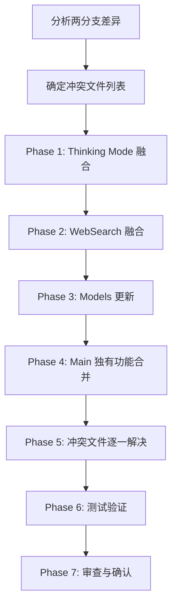

# 设计文档：合并 main 分支到 release 分支

## 概述

本设计描述了将 KiroGate 项目 `main` 分支融合到 `release` 分支的技术方案。核心挑战在于 Thinking Mode 和 WebSearch 两个功能在两个分支上有不同的实现，需要精心融合。其他 main 分支独有功能（用户系统增强、代理支持、安全加固等）可以直接合并。

### 融合策略总结

| 功能 | 基础来源 | 融合要点 |
|------|---------|---------|
| Thinking 解析器 | main (`thinking_parser.py`) | 保留假标签检测、增量解析 |
| Thinking 注入 | main (`converters.py`) | XML 标签注入，不含自然语言指令 |
| Thinking 默认行为 | release | 默认启用 |
| Thinking Budget | main | 从请求读取，默认 200000 |
| Streaming Thinking | main (`streaming.py`) | 已使用 `KiroThinkingTagParser` |
| 非流式 Thinking | main | 已在 `collect_anthropic_response` 中实现 |
| WebSearch | release (`websearch.py`) | 双格式支持、结构化模型 |
| Models | main | `AnthropicTool.input_schema` Optional + `type` 字段 |

## 架构

### 合并流程



### 当前分支状态（release 分支 = 工作分支）

当前工作目录已经在 release 分支上，且已经包含了大部分 main 分支的功能。通过代码分析发现：

- `thinking_parser.py` 已存在，包含 `KiroThinkingTagParser`（来自 main）
- `streaming.py` 已使用 `KiroThinkingTagParser` 进行解析（已融合）
- `converters.py` 使用 XML 标签注入，默认 budget 200000（来自 main）
- `models.py` 中 `AnthropicTool` 已有 `input_schema: Optional` 和 `type` 字段（已融合）
- `websearch.py` 支持 Anthropic 格式（需确认是否已包含 OpenAI 格式支持）
- `collect_anthropic_response` 已支持 thinking 解析（非流式 Anthropic）
- `collect_stream_response`（OpenAI 非流式）尚未支持 thinking 解析
- `stream_kiro_to_openai_internal`（OpenAI 流式）尚未支持 thinking 解析

## 组件与接口

### 1. Thinking Mode 组件

#### 1.1 KiroThinkingTagParser（已存在，无需修改）

```python
# kiro_gateway/thinking_parser.py - 已在当前分支
class KiroThinkingTagParser:
    """增量解析 <thinking> 标签"""
    def push_and_parse(self, incoming: str) -> List[TextSegment]
    def flush(self) -> List[TextSegment]
    
    @property
    def is_thinking_mode(self) -> bool
    @property
    def has_extracted_thinking(self) -> bool
```

#### 1.2 Thinking 注入（converters.py，已存在）

```python
# 已在当前分支，使用 XML 标签注入
def is_thinking_enabled(thinking_config) -> bool
def get_thinking_budget(thinking_config) -> int  # 默认 200000
def generate_thinking_hint(thinking_config) -> str  # XML 标签
def inject_thinking_hint(system_prompt, thinking_config) -> str
```

#### 1.3 OpenAI 流式 Thinking 支持（需新增）

`stream_kiro_to_openai_internal` 当前不支持 thinking 解析。需要添加：

```python
async def stream_kiro_to_openai_internal(
    ...,
    thinking_enabled: bool = False  # 新增参数
) -> AsyncGenerator[str, None]:
    # 当 thinking_enabled=True 时：
    # 1. 创建 KiroThinkingTagParser
    # 2. 对每个 content chunk 调用 push_and_parse
    # 3. THINKING 片段 -> delta.reasoning_content
    # 4. TEXT 片段 -> delta.content
    # 5. 流结束时 flush 缓冲区
```

#### 1.4 OpenAI 非流式 Thinking 支持（需新增）

`collect_stream_response` 当前不支持 thinking。需要添加：

```python
async def collect_stream_response(
    ...,
    thinking_enabled: bool = False  # 新增参数
) -> dict:
    # 当 thinking_enabled=True 时：
    # 1. 收集完整内容后用 KiroThinkingTagParser 解析
    # 2. 在 message 中添加 reasoning_content 字段
```

### 2. WebSearch 组件

#### 2.1 当前状态分析

当前 `websearch.py` 已包含 Anthropic 格式支持。需要确认：
- 是否已支持 OpenAI 格式（`has_web_search_tool` 检查 `ChatCompletionRequest`）
- 搜索查询提取是从第一条还是最后一条消息

如果当前仅支持 Anthropic 格式，需要添加 OpenAI 格式支持。

#### 2.2 WebSearch 接口（已存在）

```python
def has_web_search_tool(request: AnthropicMessagesRequest) -> bool
def extract_search_query(request: AnthropicMessagesRequest) -> Optional[str]
async def handle_websearch_request(...) -> StreamingResponse
```

### 3. 需要合并的 Main 独有功能

以下功能需要从 main 分支 cherry-pick 或手动合并：

| 功能 | 涉及文件 | 合并方式 |
|------|---------|---------|
| 用户系统增强 | `user_manager.py`, `database.py`, `routes.py` | 检查差异后合并 |
| HTTP/SOCKS5 代理 | `http_client.py`, `config.py` | 检查差异后合并 |
| Docker CI | `.github/workflows/` | 直接合并 |
| 安全加固 | `config.py`, `routes.py` | 检查差异后合并 |
| count_tokens 端点 | `routes.py` | 检查是否已存在 |
| IDC snake_case 导入 | `routes.py` | 检查差异后合并 |
| Token 账户信息缓存 | `auth_cache.py` | 检查差异后合并 |
| 图片支持 | `converters.py` | 检查差异后合并 |
| Kiro Portal API | `routes.py` | 检查差异后合并 |
| 版本号 2.3.0 | `config.py` / `__init__.py` | 更新版本号 |

## 数据模型

### AnthropicTool（已融合）

```python
class AnthropicTool(BaseModel):
    name: str
    description: Optional[str] = None
    input_schema: Optional[Dict[str, Any]] = None  # 已为 Optional
    type: Optional[str] = None  # 已有 type 字段
    model_config = {"extra": "allow"}
```

### Thinking 配置（已存在于 AnthropicMessagesRequest）

```python
class AnthropicMessagesRequest(BaseModel):
    ...
    thinking: Optional[Dict[str, Any]] = None  # {"type": "enabled", "budget_tokens": 1024}
```

### TextSegment（thinking_parser.py，已存在）

```python
class SegmentType(Enum):
    THINKING = auto()
    TEXT = auto()

@dataclass
class TextSegment:
    type: SegmentType
    content: str
```


## 正确性属性

*正确性属性是一种在系统所有有效执行中都应成立的特征或行为——本质上是关于系统应该做什么的形式化陈述。属性是人类可读规范与机器可验证正确性保证之间的桥梁。*

### Property 1: Thinking 解析器模式激活

*For any* 输入字符串，如果该字符串以 `<thinking>` 开头（忽略前导空白），则 `KiroThinkingTagParser` 应产生至少一个 `THINKING` 类型的片段；如果不以 `<thinking>` 开头，则所有片段应为 `TEXT` 类型。

**Validates: Requirements 1.3**

### Property 2: 假标签检测

*For any* 包含被引号字符（反引号、双引号、单引号等）紧邻的 `</thinking>` 的输入文本，当该文本位于 thinking 块内部时，`KiroThinkingTagParser` 不应将其视为真正的关闭标签。

**Validates: Requirements 1.2**

### Property 3: XML 标签注入纯净性

*For any* 有效的 thinking 配置和任意 system prompt 字符串，`inject_thinking_hint` 的输出应仅包含 XML 控制标签（`<thinking_mode>` 和 `<max_thinking_length>`），不应包含自然语言思考指令。

**Validates: Requirements 2.1**

### Property 4: Thinking Budget 解析

*For any* thinking 配置，如果配置中指定了正整数 `budget_tokens`，则 `get_thinking_budget` 应返回该值；否则应返回默认值 200000。

**Validates: Requirements 2.2, 2.3**

### Property 5: WebSearch 查询提取位置

*For any* 包含多条用户消息的 Anthropic 请求，`extract_search_query` 应从第一条消息中提取查询内容（当前实现行为）。

**Validates: Requirements 6.3**

### Property 6: AnthropicTool 可选 input_schema

*For any* 有效的工具名称字符串，创建不带 `input_schema` 的 `AnthropicTool` 实例不应引发验证错误，且 `input_schema` 字段应为 `None`。

**Validates: Requirements 7.1, 7.3**

## 错误处理

### Thinking 解析错误

| 场景 | 处理方式 |
|------|---------|
| thinking 块未正常关闭 | `flush()` 将剩余缓冲区作为 THINKING 内容输出，并记录警告日志 |
| 空输入 | `push_and_parse("")` 返回空列表 |
| 跨 chunk 的标签切分 | 解析器保留尾部可能是标签一部分的数据，等待更多输入 |

### 流式处理错误

| 场景 | 处理方式 |
|------|---------|
| 流读取超时 | 允许最多 3 次连续超时，超过后抛出 `StreamReadTimeoutError` |
| 首 token 超时 | 抛出 `FirstTokenTimeoutError`，触发重试机制 |
| JSON 解析失败 | 跳过无效 chunk，继续处理 |

### 合并冲突处理

| 场景 | 处理方式 |
|------|---------|
| 文件级冲突 | 逐文件手动解决，优先保留功能更完整的版本 |
| 导入冲突 | 合并两边的导入，去除重复 |
| 配置冲突 | 保留两边的配置项，确保向后兼容 |

## 测试策略

### 测试框架

- **单元测试**: `pytest` + `pytest-asyncio`
- **属性测试**: `hypothesis`
- 每个属性测试至少运行 100 次迭代

### 属性测试计划

| Property | 测试文件 | 生成器 |
|----------|---------|--------|
| Property 1: 模式激活 | `tests/test_thinking_parser.py` | 随机字符串，部分以 `<thinking>` 开头 |
| Property 2: 假标签检测 | `tests/test_thinking_parser.py` | 包含引号包裹的 `</thinking>` 的字符串 |
| Property 3: XML 注入纯净性 | `tests/test_converters.py` | 随机 thinking 配置 + 随机 system prompt |
| Property 4: Budget 解析 | `tests/test_converters.py` | 随机 thinking 配置（含/不含 budget_tokens） |
| Property 5: 查询提取 | `tests/test_websearch.py` | 多消息 Anthropic 请求 |
| Property 6: 可选 schema | `tests/test_models.py` | 随机工具名称 |

### 单元测试计划

- Thinking 解析器：边界情况（空输入、仅空白、未关闭标签）
- Converters：thinking 启用/禁用检测的各种输入格式
- WebSearch：搜索工具检测、查询提取
- Models：AnthropicTool 各种构造方式

### 集成验证

合并完成后的手动验证清单：
1. 运行 `pytest` 确保所有测试通过
2. 检查 Thinking Mode 流式输出（Anthropic + OpenAI 格式）
3. 检查 Thinking Mode 非流式输出
4. 检查 WebSearch 功能
5. 检查 main 分支独有功能的集成状态
6. 逐文件审查冲突解决方案

### 属性测试标注格式

每个属性测试必须包含注释引用设计文档中的属性：

```python
# Feature: merge-main-to-release, Property 1: Thinking 解析器模式激活
@given(st.text())
def test_thinking_parser_mode_activation(input_text):
    ...
```
