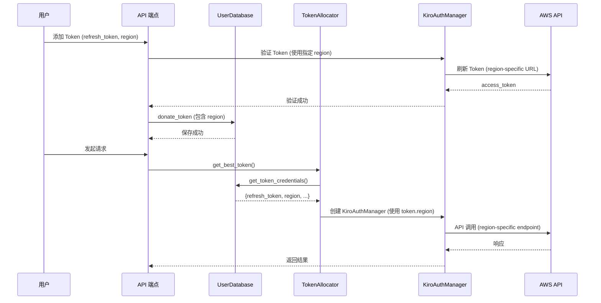
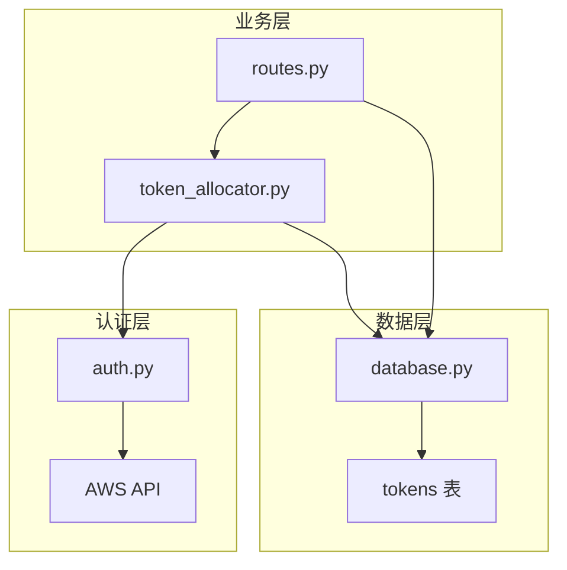

# 设计文档

## 概述

本设计文档描述了为 KiroGate 添加 Token 级别 AWS 区域支持的技术实现方案。该功能允许用户为每个 Token 单独配置 AWS 区域，系统在处理请求时自动使用对应 Token 的区域进行 API 调用。

## 架构

### 数据流



### 组件关系



## 组件和接口

### 1. 数据库层 (database.py)

#### DonatedToken 数据模型

```python
@dataclass
class DonatedToken:
    """Donated token data model."""
    id: int
    user_id: int
    token_hash: str
    auth_type: str  # 'social' or 'idc'
    visibility: str  # 'public' or 'private'
    status: str  # 'active', 'invalid', 'expired'
    region: str  # AWS 区域，默认 'us-east-1'
    success_count: int
    fail_count: int
    last_used: Optional[int]
    last_check: Optional[int]
    created_at: int
```

#### UserDatabase 方法修改

```python
def donate_token(
    self,
    user_id: int,
    refresh_token: str,
    visibility: str = "private",
    anonymous: bool = False,
    auth_type: str = "social",
    client_id: Optional[str] = None,
    client_secret: Optional[str] = None,
    region: str = "us-east-1"  # 新增参数
) -> Tuple[bool, str]:
    """添加 Token，支持指定区域。"""
    pass

def get_token_credentials(self, token_id: int) -> Optional[Dict[str, Optional[str]]]:
    """
    获取 token 的完整凭证信息（解密后）。
    
    Returns:
        包含 refresh_token, auth_type, client_id, client_secret, region 的字典
    """
    pass
```

### 2. Token 分配器 (token_allocator.py)

```python
async def _get_manager(self, token: DonatedToken) -> KiroAuthManager:
    """获取或创建 Token 对应的 AuthManager。"""
    # 获取完整凭证信息（包括 region）
    credentials = user_db.get_token_credentials(token.id)
    
    # 使用 Token 的 region 创建 AuthManager
    manager = KiroAuthManager(
        refresh_token=credentials["refresh_token"],
        region=credentials.get("region", "us-east-1"),  # 使用 Token 的 region
        profile_arn=settings.profile_arn,
        client_id=credentials.get("client_id"),
        client_secret=credentials.get("client_secret"),
    )
    return manager
```

### 3. API 端点 (routes.py)

```python
@router.post("/user/api/tokens")
async def user_donate_token(
    request: Request,
    refresh_token: str = Form(...),
    auth_type: str = Form("social"),
    client_id: str = Form(""),
    client_secret: str = Form(""),
    visibility: str = Form("private"),
    anonymous: bool = Form(False),
    region: str = Form("us-east-1"),  # 新增参数
    _csrf: None = Depends(require_same_origin)
):
    """添加新 Token，支持指定区域。"""
    pass
```

### 4. 前端界面 (pages.py)

在添加 Token 的模态框中添加区域选择器：

```html
<div class="mb-3">
  <label class="text-sm font-medium mb-2 block">🌍 AWS 区域</label>
  <select id="donateRegion" class="w-full px-3 py-2 rounded-lg text-sm">
    <option value="us-east-1" selected>us-east-1 (美国东部)</option>
    <option value="ap-southeast-1">ap-southeast-1 (新加坡)</option>
    <option value="eu-west-1">eu-west-1 (爱尔兰)</option>
  </select>
</div>
```

## 数据模型

### tokens 表 Schema 变更

```sql
-- 新增 region 字段
ALTER TABLE tokens ADD COLUMN region TEXT DEFAULT 'us-east-1';
```

### 支持的区域列表

| 区域代码 | 区域名称 |
|---------|---------|
| us-east-1 | 美国东部 (弗吉尼亚) |
| ap-southeast-1 | 亚太 (新加坡) |
| eu-west-1 | 欧洲 (爱尔兰) |

## 正确性属性

*正确性属性是一种特征或行为，应该在系统的所有有效执行中保持为真——本质上是关于系统应该做什么的形式化陈述。属性作为人类可读规范和机器可验证正确性保证之间的桥梁。*

基于预分析，以下是可测试的正确性属性：

### Property 1: Region 字段存储一致性

*对于任意* Token，如果使用指定的 region 值调用 donate_token 方法，然后通过 get_token_credentials 查询该 Token，返回的 region 值应该与存储时的值相同。

**Validates: Requirements 2.4, 3.2**

### Property 2: Token 分配使用正确区域

*对于任意* 存储了特定 region 的 Token，当 TokenAllocator 为该 Token 创建 KiroAuthManager 时，AuthManager 的 region 属性应该等于 Token 存储的 region 值。

**Validates: Requirements 3.1, 3.3**

### Property 3: 默认区域行为

*对于任意* 不指定 region 参数的 donate_token 调用，存储的 region 值应该为 'us-east-1'。

**Validates: Requirements 2.2**

### Property 4: Token 验证使用指定区域

*对于任意* 指定了 region 的 Token 添加请求，验证 Token 时创建的 KiroAuthManager 应该使用该指定的 region。

**Validates: Requirements 2.3**

## 错误处理

### 无效区域处理

当用户提供不支持的区域时：
- API 层验证区域是否在支持列表中
- 返回 400 错误码和明确的错误消息

```python
SUPPORTED_REGIONS = {"us-east-1", "ap-southeast-1", "eu-west-1"}

if region not in SUPPORTED_REGIONS:
    return JSONResponse(
        status_code=400, 
        content={"error": f"不支持的区域: {region}"}
    )
```

### 区域连接失败处理

当特定区域的 AWS API 不可用时：
- 记录错误日志
- 标记 Token 状态为 invalid
- 返回适当的错误响应

## 测试策略

### 单元测试

1. **数据库层测试**
   - 测试 region 字段的数据库迁移
   - 测试 donate_token 方法正确存储 region
   - 测试 get_token_credentials 返回正确的 region

2. **Token 分配器测试**
   - 测试 _get_manager 使用正确的 region 创建 AuthManager
   - 测试不同 region 的 Token 分配

3. **API 端点测试**
   - 测试添加 Token 时传递 region 参数
   - 测试默认 region 值
   - 测试无效 region 的错误处理

### 属性测试

使用 `hypothesis` 库进行属性测试：

- **Property 1**: Region 字段存储一致性
  - 生成随机的 region 值（从支持列表中）
  - 验证存储和查询的一致性
  - 最少 100 次迭代

- **Property 2**: Token 分配使用正确区域
  - 生成随机的 Token 和 region 组合
  - 验证 AuthManager 使用正确的 region
  - 最少 100 次迭代

- **Property 3**: 默认区域行为
  - 不传递 region 参数
  - 验证默认值为 'us-east-1'
  - 最少 100 次迭代

### 测试配置

```python
# pytest + hypothesis 配置
from hypothesis import given, strategies as st, settings

SUPPORTED_REGIONS = ["us-east-1", "ap-southeast-1", "eu-west-1"]

@settings(max_examples=100)
@given(region=st.sampled_from(SUPPORTED_REGIONS))
def test_region_storage_consistency(region):
    """Feature: per-token-region-support, Property 1: Region 字段存储一致性"""
    pass
```
